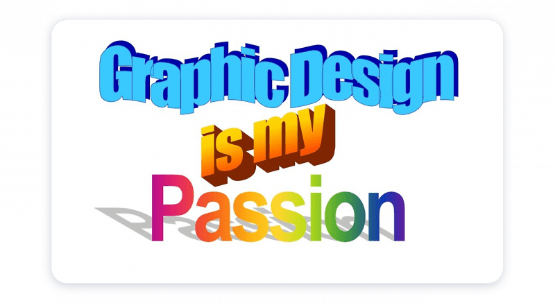

<body>
  
  
  
  Sample text
   
   
  <h2>Actually Important Stuff</h2>
  <i>It's a time box!</i>
   
  
  <h2>List of my greatest accomplishments:</h2>
  <ul>
      <li>Making <a href="{{site.baseurl}}/">this blog</a></li>
      <li>Making the <a href="https://i.ibb.co/QcHcsgc/Untitled-drawing.png">background image</a></li>
      <li>
        
      </li>
      <li></li>
  </ul>
</body>